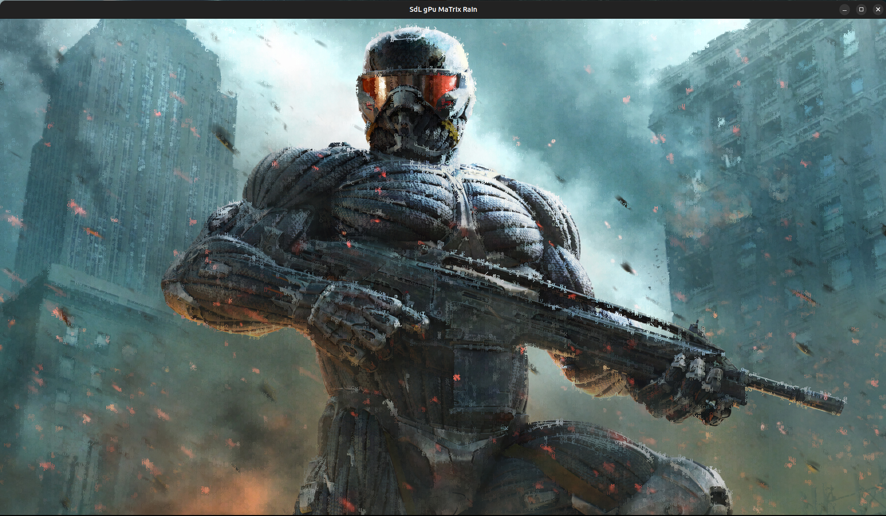
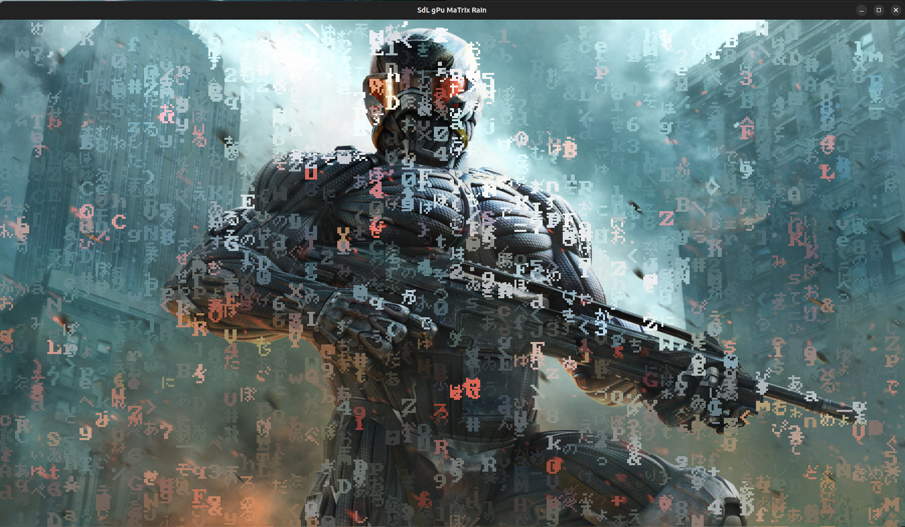

# sdl3-gpu-compute-matrix-rain

a SDL3 SDL_gpu compute shaders divided in 3 compute shaders passes to display matrix rain built on compute shader-based rasterized glyphs

compute shader sources can be on-demand compiled but needs glslc https://github.com/google/shaderc to be installed

